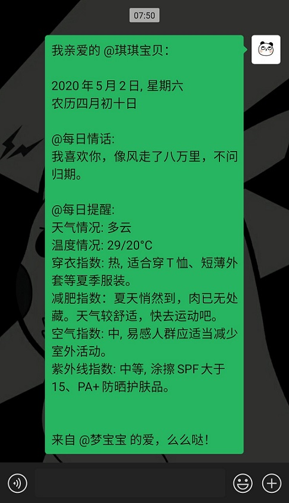

# Python 脚本定时自动给女票发送贴心消息提醒

> 如何做一个贴心的程序员男朋友？从微信每日贴心提醒开始吧！

## 功能及消息内容
### 功能
- 本地扫码登录微信自动定时发送（PS：如需每日定时自动发送不能关机！）；
- 部署到服务器执行脚本`run.sh`实现自动定时发送微信消息；

PS：最好采用一个小号发送消息，**微信客户端和网页端不能同时登录**！

### 内容包括但不限于：
- 日期（阳历+阴历）；
- 每日壹句
  - 壹句英文（内容来源[爱词霸](http://news.iciba.com/)）；
  - 壹句情话（内容来源[渣男：说话的艺术](https://lovelive.tools/)）;
- 天气预报（内容来源[中国天气网](http://www.weather.com.cn/)）：
  - 天气情况；
  - 温度情况；
  - 穿衣指数； 
  - 减肥指数；
  - 空气指数；
  - 紫外线指数；

## 消息效果


## 依赖包
- requests==2.22.0
- schedule==0.6.0
- sxtwl==1.0.7
- itchat==1.3.10

## 执行流程
1. 安装依赖包
    ```shell script
    pip install -r requirements.txt
    ```
2. 执行脚本
    ```shell script
    ./run.sh
    ```
    修改`run.sh`参数：
    - `-s`:微信消息中包含的发送人名称；
    - `-r`:微信收件人微信昵称（注意不是备注名！）；
    - `-c`:微信收件人所在城市对应的城市编码；
    - `-t`:微信消息提醒时间，默认为`8:00`；
3. 手机扫描终端显示的二维码登录！
    
PS：城市编码在[中国天气网](http://www.weather.com.cn/forecast/) 中自行查询；可在微信公众号【DreamHub】回复【daily】领取城市编码对应表格；)

## 关注作者
如果需要增加功能或存在任何问题请联系我！


